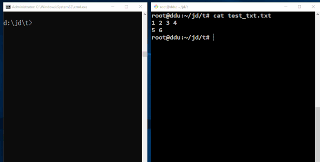

# TFR — To or From Redis


[](https://github.com/tlqtangok/go_tfr/releases)
[](LICENSE)

> **TFR** (To or From Redis) is a productive tool that syncs and shares your files, directories instantly, efficiently and elegantly — via Redis as the transport layer.

Go rewrite of the original [Perl TFR](https://github.com/tlqtangok/tfr).  
Wire-compatible with the Perl version: Go ↔ Perl cross-transfer works seamlessly.

---



*Left: Windows machine · Right: Linux machine — push with `tor`, pull with `fr`*

---

## Features

- **Zero setup** on the receiver side — just run `tfr f`
- Transfer files, directories, or piped stdin
- Password protection per transfer
- Folder auto-tar + compress
- 256 rotating slots (`jd_0` ~ `jd_255`)
- Visitor log (`show_visitor` command)
- Cross-platform: Linux / Windows / macOS

---

## Install

### Choose Your Binary

| File | OS | Architecture | Notes |
|------|----|-------------|-------|
| `tfr_linux_amd64` | Linux | x86_64 (64-bit) | **Most common** — servers, desktops, WSL |
| `tfr_linux_arm64` | Linux | ARM64 | Raspberry Pi 4+, AWS Graviton, Apple M1 (Linux VM) |
| `tfr_windows_amd64.exe` | Windows | x86_64 (64-bit) | Windows 10/11, rename to `tfr.exe` |
| `tfr_darwin_amd64` | macOS | x86_64 (Intel) | Intel Mac (pre-2021) |

> **How to check your platform:**
> - Linux: `uname -m` → `x86_64` = amd64, `aarch64` = arm64
> - macOS: `uname -m` → `x86_64` = Intel, `arm64` = Apple Silicon (run under Rosetta or use Linux ARM64 in VM)
> - Windows: Settings → System → About → "64-bit operating system, x64-based processor"

> **About UPX compression:** All Linux/Windows binaries are compressed with UPX (`--best`).  
> They self-decompress in memory at startup (~10–20 ms overhead, zero runtime impact).  
> macOS binaries are **not** UPX-compressed (macOS 10.15+ rejects UPX-packed binaries due to code signing).

### Quick Install

```bash
# Linux x86_64
curl -L https://github.com/tlqtangok/go_tfr/releases/latest/download/tfr_linux_amd64 -o /usr/local/bin/tfr
chmod +x /usr/local/bin/tfr

# Linux ARM64 (Raspberry Pi, Graviton)
curl -L https://github.com/tlqtangok/go_tfr/releases/latest/download/tfr_linux_arm64 -o /usr/local/bin/tfr
chmod +x /usr/local/bin/tfr

# macOS (Intel)
curl -L https://github.com/tlqtangok/go_tfr/releases/latest/download/tfr_darwin_amd64 -o /usr/local/bin/tfr
chmod +x /usr/local/bin/tfr
```

Windows: download `tfr_windows_amd64.exe`, rename to `tfr.exe`, place in a folder on your `%PATH%`.

---

## Configuration

Place `tfr.config` in the same directory as the binary (or current working directory):

```ini
# [required]
$redis_host = "your.redis.host";
$redis_port = 6379;

# [optional] defaults shown
# $max_file_sz_in_bytes = 52434944;   # 50 MB + 5 KB
# $max_jd_incr = 256;
```

---

## Usage

### `tor` — Send (Transfer Out via Redis)

```bash
# Send a file
tfr tor <filename>
tfr t   <filename>          # shorthand

# Send with password
tfr t <filename> -pw <password>

# Send a directory (auto tar+gzip)
tfr t <dirname>

# Pipe stdin
echo "hello world" | tfr t
cat file.txt       | tfr t
```

Output: the slot ID, e.g. `jd_42`

---

### `fr` — Receive (From Redis)

```bash
# Receive latest slot (no args)
tfr fr
tfr f               # shorthand

# Receive a specific slot
tfr f jd_42

# Receive with password
tfr f jd_42 -pw <password>

# Pipe output directly to shell
tfr f | bash
```

- Text files: content is printed to stdout, saved to `txt.txt`
- Binary/archive files: saved to original filename in current directory

---

### `show_visitor` — Show Visitors

```bash
# Show last 10 visitors
tfr show_visitor

# Show last N visitors
tfr show_visitor 30
```

---

### Version / Help

```bash
tfr -v
```

---

## Examples

```bash
# ── Machine A (sender) ────────────────────────
$ echo "deploy this" | tfr t
jd_17

$ tfr t ~/projects/myapp -pw secret
jd_18

# ── Machine B (receiver) ──────────────────────
$ tfr f
deploy this
- file content save to txt.txt

$ tfr f jd_18 -pw secret
- extracting myapp/...

# ── Pipe trick ────────────────────────────────
$ echo "ls -la" | tfr t
jd_19

$ tfr f jd_19 | bash
total 48
drwxr-xr-x ...
```

---

## Slots

TFR uses a rotating counter `jd_incr` stored in Redis.  
Each `tfr t` call increments it and assigns a slot (`jd_1`, `jd_2`, … `jd_255`).  
On the 256th upload the counter wraps to `jd_0`, **all slot data is cleared automatically**, and the cycle restarts.  
Slot data has **no automatic expiry** — it persists until overwritten or the counter wraps.

---

## Build from Source

**Requirements:** Go 1.22+, optionally UPX for compressed binaries.

```bash
git clone https://github.com/tlqtangok/go_tfr.git
cd go_tfr

# Build current platform
./build.sh linux

# Build all platforms
./build.sh all

# Clean
./build.sh clean
```

Or manually:

```bash
go build -ldflags="-s -w" -trimpath -o tfr .
```

---

## Compatibility

| Sender | Receiver | Status |
|--------|----------|--------|
| Go TFR | Go TFR   | ✅ |
| Go TFR | Perl TFR | ✅ |
| Perl TFR | Go TFR | ✅ |
| Perl TFR | Perl TFR | ✅ |

---

## Performance Benchmark

Tested locally against a remote Redis server over the internet.  
Files: 5 MB random text (printable ASCII) and 5 MB random binary.

| Version  | File       | Upload  | Download |
|----------|------------|---------|----------|
| **Go**   | text 5MB   | 1143 ms |  8595 ms |
| **Perl** | text 5MB   | 4206 ms | 14535 ms |
| **Go**   | binary 5MB | 1057 ms | 11519 ms |
| **Perl** | binary 5MB | 4665 ms | 18494 ms |

**Go is ~3.7–4.4× faster on upload, ~1.6–1.7× faster on download** vs the original Perl version.  
Bottleneck is network RTT to Redis; Go's advantage comes from faster startup, more efficient I/O, and native gzip.

---

## Author

**Jidor Tang** <tlqtangok@126.com>  
GitHub: [@tlqtangok](https://github.com/tlqtangok)

Original Perl version co-authored with Jesson Liu ([@LjessonS](https://github.com/LjessonS))

---

## License

GNU General Public License v3.0 — see [LICENSE](LICENSE)
